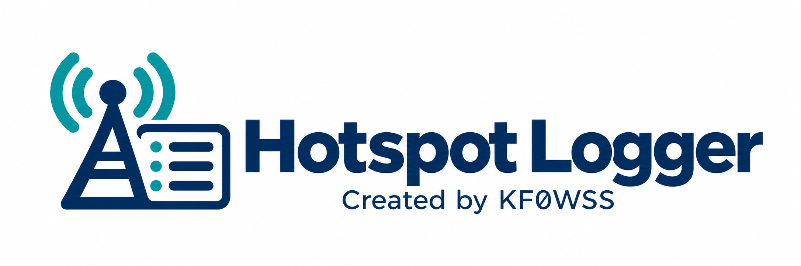

# Hotspot Logger



**Review digital voice contacts from your WPSD hotspots and save them to QRZ Logbook or ADIF.**

Hotspot Logger keeps a queue of stations heard by your hotspots. After a QSO, open the contact, check the details, and save it. Nothing is uploaded automatically.

Run it on an **Ubuntu VM, a Linux computer, or a Raspberry Pi with a 64-bit OS**, then use it from your desktop or phone. All logger settings are entered in the browser.

**Public beta · 0.8.0-beta.5** — Created by **[KF0WSS](https://www.qrz.com/db/KF0WSS)**.

## Install

On Ubuntu, Debian, or Raspberry Pi OS Lite **64-bit**, open a terminal and run:

```bash
sudo apt update && sudo apt install -y git
git clone https://github.com/mattatat25/hotspot-logger.git
cd hotspot-logger
bash setup.sh
```

Setup offers to install Docker if it is missing, starts the logger, checks that it responds, and prints the address to open. Enter your Linux password if `sudo` asks for it. You do not need to edit an `.env` file, install Python packages, or log out to join a Docker group.

Open **`http://SERVER_IP:8787`** in your browser. The setup page walks you through:

- Your callsign and a logger password.
- A name, address, and radio transmit frequency for each hotspot.
- An optional QRZ Logbook API key.

Use a separate Pi or computer for the logger; leave your WPSD hotspot installation as it is. A **Pi 4 or Pi 5 with 2 GB RAM** is a sensible starting point. For an Ubuntu VM, start with **2 vCPUs, 2 GB RAM, and 20 GB disk**. These are suggested allocations, not measured minimums.

See the [installation guide](docs/INSTALL.md) for Pi imaging, SSH, other Docker hosts, and ZIP downloads. Already running an earlier version? **Keep your existing installation folder** and follow [the update guide](docs/BACKUP-AND-UPDATES.md).

## Your first contact

1. Make a two-way contact on your radio.
2. Find the station in the logger and select **Review**.
3. Check the callsign, UTC time, mode, frequency, and comment.
4. Select **Log to QRZ** or **Save to ADIF**.

**Heard only** means the station appeared in WPSD. **Possible exchange** means the logger saw A/B/A or B/A/B activity involving your RF callsign. It can miss contacts or flag unrelated activity; you decide whether a QSO took place.

QRZ uploads need a Logbook API key and an eligible subscription. You can leave the key blank and use **ADIF export** instead. [QRZ setup instructions](docs/USAGE.md#set-up-qrz)

## What it does

- Reads DMR, YSF/C4FM, D-Star, P25, NXDN, and FM activity; recognizes M17 from older feeds.
- Tracks up to 16 labeled hotspots with separate frequencies and connection status.
- Opens possible exchanges first, with a separate activity queue and saved-contact view.
- Uses a desktop table and phone-friendly contact cards, with Local and UTC clocks.
- Matches WPSD theme colors and captures YSF room names when available.
- Lets you review, save, delete, and export contacts.
- Prevents resubmitting the same saved entry and holds uncertain QRZ results for you to check.
- Keeps your settings and contacts through updates, with backup and restore scripts included.

The logger reads WPSD without installing anything on the hotspot. Your own transmissions, paging messages, and unresolved numeric callers are excluded from the contact queue. It does not identify every transmission from the same QSO as a duplicate—review the queue before saving another entry.

## Update or back up

From your installation folder:

```bash
bash scripts/update.sh
```

The updater backs up the running logger before downloading and starting the new version. To make a backup without updating:

```bash
bash scripts/backup.sh
```

Keep a copy outside the server. Backups contain your settings, credentials, and contacts. [Backup and restore instructions](docs/BACKUP-AND-UPDATES.md)

## Help

| Guide | What you will find |
| --- | --- |
| [Install](docs/INSTALL.md) | Ubuntu, Raspberry Pi, Docker, and first-run setup |
| [Use the logger](docs/USAGE.md) | Settings, modes, rooms, contact review, and QRZ results |
| [Back up and update](docs/BACKUP-AND-UPDATES.md) | Backup, restore, upgrades, and moving servers |
| [Troubleshoot](docs/TROUBLESHOOTING.md) | Connection, login, time, and logging problems |
| [WPSD compatibility](docs/WPSD-COMPATIBILITY.md) | Feed fields and known limits |
| [Changelog](CHANGELOG.md) | Changes by version |

Found a bug? [Open an issue](https://github.com/mattatat25/hotspot-logger/issues). Include your version and steps to reproduce it; leave out passwords, API keys, and backups. Code contributions are welcome—see [CONTRIBUTING.md](CONTRIBUTING.md).

## Privacy and network access

Settings and contacts stay in your local Docker data volume. Contact details are sent to QRZ only when you choose **Log to QRZ**. There is no analytics or telemetry service.

Keep port **8787** on your trusted LAN. Use a private VPN for access away from home; do not forward the port through your router. See [SECURITY.md](SECURITY.md) for details and vulnerability reporting.

## License and credits

Created by **KF0WSS**. Software released under the [MIT license](LICENSE).

Hotspot Logger is an independent project, not affiliated with or endorsed by WPSD or QRZ.com. Those names identify the services it works with. [Compatibility and licensing](docs/COMPATIBILITY-AND-LICENSING.md)
