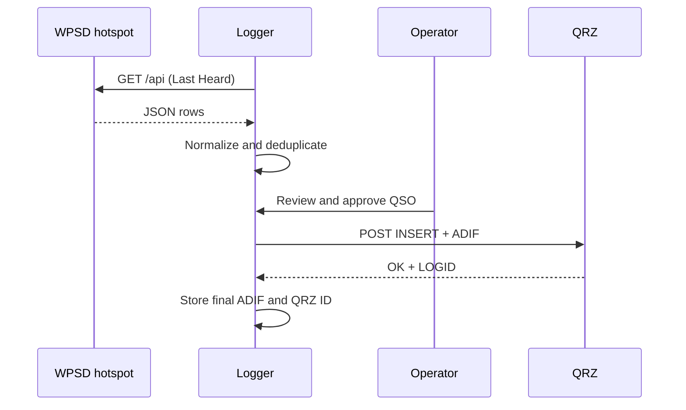

# Architecture

## Design goals

1. Keep WPSD stock and updateable.
2. Require operator review before a QSO is logged.
3. Keep credentials on the companion host.
4. Avoid duplicate submission after ambiguous network failures.
5. Keep deployment small enough for a Raspberry Pi, VM, or NAS.

## Components

| Component | Responsibility |
| --- | --- |
| WPSD poller | Reads Last Heard for each configured hotspot and reports source-specific failures |
| Normalizer | Accepts known field variants, recognizes voice protocols, and scopes identities by source |
| SQLite | Stores GUI configuration, candidate rows, state, QRZ IDs, and final ADIF records |
| Setup UI | First-run wizard and authenticated settings editor |
| Review UI | Compact activity table, source/mode filters, possible exchanges, and individual contact review |
| QRZ client | Sends official form encoded `INSERT` requests with an identifiable user agent |
| ADIF export | Emits every saved or successful QRZ record as ADIF 3.1.7 |

## Data flow

## Failure behavior

- WPSD unavailable: existing rows remain usable and the page reports a degraded poll state.
- Unknown WPSD schema: no row is guessed; the page asks for adapter inspection.
- QRZ explicitly rejects the request: the candidate reopens for correction and its draft ADIF is cleared.
- QRZ times out, returns an HTTP error without an explicit rejection, or sends an incomplete confirmation: the row stays pending for reconciliation and is never retried automatically.
- QRZ key absent: direct logging is disabled and ADIF remains available.

## Storage

The SQLite database uses WAL mode and lives at `/data/logger.sqlite` in a named Docker volume. It contains configuration, the QRZ key, a salted web-password hash, and contact state. Unlogged candidates expire after 14 days. The GUI can delete individual entries and their ADIF copies, or clear unlogged candidates while retaining saved contacts and uncertain QRZ submissions. A separate table retains only removed record IDs to prevent their reimport. Local deletion does not call the QRZ API.

Theme matching reads the configured hotspot's public dashboard and same-origin theme stylesheet in the polling worker. Colors are refreshed every five minutes and cached in memory. Only validated hex colors are rendered into the logger's own CSS variables; remote scripts, CSS rules, and external stylesheet links are not imported. A GUI preference can disable matching. Theme failures do not interrupt contact polling.

GUI configuration contains stable hotspot IDs, names, URLs, and radio transmit frequencies. The original source retains the `primary` ID and existing contact hashes. Additional source IDs are included in record hashes so equal transmissions across hotspots remain independent. Removing a source keeps its history; an unavailable source does not abort polling the rest. Theme caches are keyed by source URL, and the selected source determines the displayed palette.

Additive migrations attach source identity, an observed YSF room, and exchange evidence to existing candidate rows without rewriting saved ADIF. A separate activity table retains minimal source/channel/callsign/time/duration metadata, including the operator's own RF bursts. Consecutive A/B/A or B/A/B patterns within five minutes can flag a possible exchange; network echoes, kerchunks, mixed participants, mismatched channels, and source boundaries prevent qualification. Activity expires after 14 days and deleted contact metadata is removed.

Current YSF rooms are read from public status-panel HTML with the standard library HTML parser. API-provided rooms are preferred. Current status is attached only to fresh transmissions, and later room changes do not rewrite captured rooms. Old entries with unknown rooms get explicitly labeled current-room suggestions at review time.

Uploads use ADIF DIGITALVOICE and valid submodes for YSF, DMR, D-Star, and legacy M17; P25/NXDN stay DIGITALVOICE with protocol comments. FM uses FM. Propagation is operator-editable and defaults to INTERNET for network arrivals. Exchange evidence never sets QRZ confirmation flags or triggers an upload.

Saved rows retain the reviewed callsign, time, and mode. Their stable ID and raw WPSD record remain unchanged, so subsequent polls cannot replace the operator's corrections. The final ADIF holds the reviewed frequency, band, propagation, and comment. ADI fields use printable ASCII and valid decimal frequencies. Export includes only local saves and successful or manually reconciled QRZ uploads; rejected and pending submissions are excluded.

`maintenance.py` streams a consistent SQLite snapshot to the backup script. Restore stages and validates a single database from the archive while the service is still running. The shell script then stops the service, swaps the validated database, removes stale WAL sidecars, and restarts it. Backup files are created with private permissions.

## Trust boundaries

- WPSD JSON is treated as untrusted input and escaped before HTML output.
- Hotspot form controls use a small local script authorized by a content hash in the page's Content Security Policy. Remote scripts remain disallowed.
- QRZ credentials are used only in server side HTTPS requests.
- The initial setup form requires a cryptographic per-process form token. After setup, forms require HTTP authentication and a persistent HMAC form token. Optional browser Origin/Referer headers are not required on private-LAN HTTP pages.
- The container root filesystem is read only and Linux capabilities are dropped.
